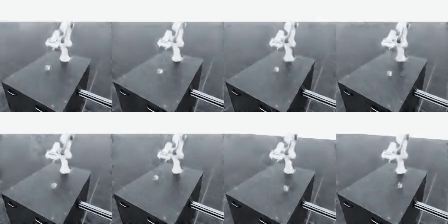

# Franka VLA — cube lifting from vision and language in Isaac Sim

Teaching a Franka Panda arm to pick up a cube using **only camera images and a
language instruction** — no privileged access to the cube's coordinates at
inference time. The policy is [SmolVLA](https://huggingface.co/blog/smolvla)
(450M parameters, flow matching, action chunking), trained by imitation from a
scripted expert that *does* know where the cube is.

> **Status: the closed loop works — 143/200 (71.5%) on the best model.**
> For most of this project it read 0/20. That number was a measurement bug, not
> the policy. The jump from 56% to 71.5% is not a modelling change either: the
> training data itself was being corrupted by the simulator, in 23% of episodes
> — see [*the randomizer was breaking the robot*](#what-the-measurements-revealed).



*Eight episodes running in parallel, front camera, ~5 s each — one untouched
wave of the evaluation, not a hand-picked run. Seven tiles grasp the cube and
lift it; the rightmost tile of the top row comes down onto the table beside the
cube and never closes the gripper. That few-centimetre miss is the whole remaining problem. The measured
rate over 200 episodes is 71.5%; this particular wave sits above it. The
lighting differs from tile to tile — that is the domain randomization.*

---

## The pipeline

```
 1. collect        Isaac Sim + scripted expert  ──►  HDF5
                   (images, robot state, expert actions, true cube pose)

 2. convert        HDF5  ──►  LeRobot dataset
                   object-centric actions, zeroed state, auxiliary cube target

 3. train          SmolVLA fine-tune (local RTX 3060, 6 GB)

 4. serve          policy_server.py  ── socket ──►  Isaac Sim
                   (three isolated Python envs; raw bytes, not pickle)

 5. evaluate       closed loop in sim + offline localization probe
```

Steps 1 and 4 run in the `isaaclab` conda env, steps 2–3 in `lerobot`. They
cannot share a process: Isaac Sim's Kit runtime pins its own NumPy, so
cross-environment data moves as **raw bytes** over a socket
([`bridge_protocol.py`](scripts/bridge_protocol.py)), never pickle.

---

## What makes this hard

The expert state machine reads the cube's exact pose from the simulator. The
policy never sees it — two RGB cameras and a text instruction, that is all. So
the policy has to *learn to localize the cube from pixels* as a side effect of
imitating the expert's motion.

It turns out that is where almost all the difficulty lives, and that standard
imitation-learning metrics hide it completely.

---

## What the measurements revealed

Most of the effort here went into measurement, not modeling. Five findings that
generalize beyond this project:

**0. The randomizer was breaking the robot.** The table-colour randomiser bound
a `UsdShade` material to the table prim. The table has a collider, and applying
a material binding to it *while the simulation is running* makes PhysX rebuild
its collision representation. At the next episode reset the articulation takes
an impulse no drive could produce: the arm moves 2 rad in a single control step
and runs away past 1900 rad/s against a 2.175 rad/s joint limit. It never
recovers. **23% of episodes** — so 23% of the training images show a physically
impossible robot, and the scripted expert's apparent ceiling of 88% was entirely
this. With the randomiser disabled the expert scores **224/224**.

The binding never worked anyway: the table is an instanced USD asset, zero
meshes were ever bound, and the table colour never changed once. Pure cost,
zero benefit.

Eight fixes were tried before this was found — drive stiffness, solver
iterations, self-collisions, clamping the IK output to joint limits, holding the
arm at home after reset, resetting the drive target. Every one of them was in
the physics layer; the trigger was in the USD scene layer, which none of them
touched. What eventually found it was ablation in the opposite direction: build
the simplest environment that does **not** reproduce the failure, then add the
real pipeline back one piece at a time. Three probes in a row scored 0/32, 0/40,
0/40 — the useful question was not "why is the probe wrong" but "what do these
three have that the real pipeline doesn't".

**1. Open-loop metrics lie.** Action MAE 5 mm, quaternion MAE 0.0005, gripper
accuracy 100%, loss 0.029 — and the policy could not find the cube at all. Every
one of those compares the policy to *the expert's action sequence*. While the arm
is already moving, "keep doing what you were doing" saturates them. The metric
that mattered was a task-goal probe
([`localize_test.py`](scripts/diagnostics/localize_test.py)): take the policy's
plan, find its lowest point, and compare that XY to where the cube actually is.

**2. A probe that "proved" the data was fine was itself leaking.** A small CNN
trained on the same frames appeared to localize the cube to 12 mm, which for
weeks anchored the belief that the information was in the images and SmolVLA
was simply failing to use it. The probe split train/validation **by frame**, but the
cube is stationary within an episode — so frames of the same episode landed on
both sides and the model could memorize "this scene looks like that, the cube is
there". Re-run with an **episode-level** split, the same architecture scores
82 mm. The claim may still be true; it is no longer demonstrated.

**3. Shortcut learning.** With the robot's joint state in the observation, the
policy learned to read the arm's position instead of looking at the cube — the
expert's trajectory is a deterministic function of the cube pose, so the arm's
own configuration leaks the answer. Fixed by zeroing the state vector and making
actions **object-centric** (x, y expressed relative to the cube, which the model
must predict itself via an auxiliary output head).

**4. The two ends of the pipeline kept disagreeing.** This single failure mode
appeared **nine** separate times and cost more than everything else combined.
The last two are the ones that had been hiding the working policy:

| # | mismatch | how it showed up |
|---|---|---|
| 1 | training data collected with a *different camera pose* than eval | depth (x) collapsed live, lateral (y) was fine |
| 2 | 8 parallel envs when collecting, 1 when evaluating | x slope 0.202 → 0.494 once matched |
| 3 | frame 0 of every episode was the *previous* episode's render | all localization numbers were artifacts |
| 4 | success filter counted a cube *flung into the air* as a success | one episode out of 550 broke normalization (action std 0.113 → 2.466) |
| 5 | expert's 0.2 s REST phase wrote `des_ee_pose = ee_pose` | unlearnable labels; also inflated the x action std 7× |
| 6 | LeRobot ignores dataset cameras if the checkpoint config lists its own | a third camera was about to be *silently dropped* from training |
| 7 | eval's warmup stepped the sim with a **zero action** | in an IK-Abs action space that is an invalid end-effector target: the arm was flung into a pose never seen in training, and the arm dominates the camera view |
| 8 | eval read the cube's height **after** `env.step()` | Isaac Lab auto-resets inside that call, so `final_z` was always the freshly spawned cube (0.055 m) and the success test `final_z > 0.10` **could never pass** |
| 9 | eval broadcast env 0's action to all 8 envs and scored only env 0 | collection gave each env its own action; the same policy scored 2% one way and 38% the other |

Number 6 is worth dwelling on: [`factory.py:305`](https://github.com/huggingface/lerobot)
only fills `input_features` from the dataset **if the policy config's copy is
empty**. Fine-tuning from an existing checkpoint would have trained on two
cameras while we believed it was three — and produced a confident, wrong
conclusion that the third camera does not help.

**5. Never evaluate a model on data it trained on.** A three-camera model scored
an x-slope of 0.903 on its own training set and 0.747 on freshly collected
episodes. The first number looked like a breakthrough. It was memorization.

**6. The replacement metric was also a proxy, and also lied.** After open-loop
metrics were caught lying, a localization probe became "THE metric" and every
decision rested on it for weeks. Once success could actually be measured, the
correlation between that probe and task success turned out to be **+0.31** —
the wrong sign. The model with the best probe score (26.3 mm) has the worst
success rate (1%); the model with the worst probe score (49.4 mm) is second
best (31%). The probe measures one plan at the start of an episode; the task is
a 250-step closed loop, and everything in between — recovering from drift,
gripper timing, not knocking the cube away — is invisible to it. Two branches
were closed on that evidence and both were wrong. Success rate is now the
decision metric; 200 episodes take 8 minutes.

**7. A wrong fix can close a branch for weeks.** Number 7 in the table above —
the warmup — was attempted once, nine days before it was found. The attempted
fix held the arm in place, but read the end-effector pose from a stale buffer
right after reset, so the arm was commanded to the *previous* episode's pose. It
measured worse than the zero action, and a comment went into the code saying to
keep the zero action. Both behaviors were broken; the measurement compared two
bugs and the losing one became a documented rule. The eventual fix avoids both
by issuing no command at all — the warmup only ever needed to refresh the camera
(`sim.render()`), not to step physics.

---

## Current numbers

200 episodes per model, each evaluated in the camera regime it was trained in.

> **The rows below `train_combo2` were all measured in a simulator that was
> breaking the arm in ~23% of episodes, and trained on data with the same
> corruption. They are kept because the *ordering* between them is still
> informative, but the absolute numbers understate every model.**

| model | regime | success | localization probe |
|---|---|---|---|
| **`train_combo2`** | same recipe as `train_combo`, **clean data** | **143/200 (71.5%)** | 49.0 mm → 15.3 mm |
| `train_combo` | fixed camera + DART + 3 cameras | 111/200 (56%) | — |
| `train_fixcam` | fixed camera | 76/200 (38%) | 31.6 mm |
| `train_dart2` | randomized + DART noise | 62/200 (31%) | 49.4 mm |
| `train_3kam` | randomized, 3 cameras | 35/200 (18%) | 33.6 mm |
| `train_geo3` | randomized, 2 cameras | 24/200 (12%) | 41.4 mm |
| `train_rest` | randomized, REST frames dropped | 22/200 (11%) | 41.4 mm |
| `train_fixdag` | fixed camera + DAgger | 2/200 (1%) | **26.3 mm** |

Two branches had been closed as failures on the broken metric and are in fact
among the best: **DART** and the **third camera**. Combining them with the fixed
camera — the first time all three were used together — took the policy from 38%
to 56%, and the gripper-never-closes failure fell from 75% of episodes to 12%.
Re-collecting that same recipe once the simulator stopped breaking the arm took
it to **71.5%** without changing a single hyperparameter.

A caveat worth stating plainly: 56% and 71.5% are **not a controlled
comparison.** The evaluation script also called the randomiser, so the older
number was measured in the same broken simulator it was trained in. 71.5% is the
first figure that is both trained on clean data and measured in a clean
environment. It is the new baseline, not a 15-point improvement over a
like-for-like control.

The "first wave artifact" — the belief that episodes 0–7 of every run were
broken because the cube fell through the table — **was diagnosed backwards.**
The table sits at z = 0 and the ground plane at z = **−1.05**; a cube that fell
through the table would read −1.029, not 0.021. 0.021 is simply the cube resting
*on* the table. The anomaly was the other value: 0.079 m, the cube floating
5.8 cm above the surface on the phantom collider left by the material binding.
So the first eight episodes were the only correct ones in every run, and
`--skip_episodes 8` was discarding the one clean wave. Both the flag and the
workaround are gone.

**Why `train_fixdag` collapses** is worth stating, because it is a structural
flaw in DAgger with a scripted expert rather than a tuning problem. The expert
is a state machine whose phase is internal. When the learner never reaches the
grasp pose, the machine never leaves `APPROACH`, so it never emits a close-gripper
command: **96 of 104 DAgger episodes contain no gripper-close label at all**
(41% of frames in expert data, 3.4% here). Half the training set then teaches
"in situations like this, keep the gripper open" — and those are exactly the
situations the policy meets at evaluation. This also explains why DART works
where DAgger fails: DART perturbs the expert's *own* trajectory, so the phase
advances normally and the close-gripper examples survive.

The fix is a [phase-agnostic expert](scripts/stateless_expert.py) that
recomputes its phase from geometry every step — *holding the cube → lift;
within 15 mm of it → close; aligned above it → descend; otherwise → approach
10 cm above it* — with the thresholds read off the data rather than guessed
(finger joints total 0.080 open, 0.045 holding the cube). It drives the task
to 92% on its own, and the labels it produces in DAgger rollouts contain
close-gripper commands in 18% of frames instead of 3.4%. Because it carries no
internal state, it also recovers for free: if the cube slips out of the gripper
the distance check fails and the expert simply says *go back and approach
again* — which is the behaviour DAgger is supposed to collect.

---

## Approaches tried

| approach | outcome |
|---|---|
| Object-centric action space | **kept** — closed-loop targeting improved ~10× |
| Auxiliary cube-position head | **kept** — also gives a direct readout of what the model sees |
| Zeroed state vector | **kept** — removes the shortcut |
| Weighting vision-critical frames | **kept** — vision only matters in ~15 of 250 frames per episode |
| Render-only warmup in eval | **kept** — stepping with a zero action flung the arm out of distribution |
| **Fixed camera** | **best single change** — 12% → 38%. Randomising the camera ±25 cm / ±20° changes the pixel→world mapping every episode, so the model must infer the camera pose before it can locate the cube, from 208 episodes |
| **DART (noise injection)** | **31%** — was wrongly eliminated on the broken metric |
| **Third (side) camera** | **18% vs 12%** — also wrongly eliminated |
| **All three together** | **56%** — the three gains compose; gripper-never-closes fell from 75% to 12% of episodes |
| **Disabling the table-colour randomiser** | **56% → 71.5%** on the same recipe. Not a modelling change: it stopped the simulator from breaking the arm in 23% of episodes. Expert success 88% → 100%, joint-limit violations 23% → 0, and every episode now survives the conversion filters |
| Skipping the first wave | **reverted — the diagnosis was inverted.** 0.021 m is the cube resting *on* the table (ground plane is at −1.05); 0.079 m was the anomaly. Episodes 0–7 were the only clean ones and the flag was discarding them |
| Domain randomization in eval | necessary once training used it, but adding it to eval was the wrong half of the fix: removing it from *training* is what helped |
| Clean + noisy data mixture | no gain |
| Dropping the expert's REST frames | 11% vs 12% — no real effect |
| DAgger (phased expert) | **1%** — the scripted expert stops emitting gripper-close labels; see below |
| Phase-agnostic expert | fixes the label collapse: close-gripper frames went 3.4% → 18%, episodes with no close label 92% → 51%. Scores 92% driving on its own. Dataset built; superseded by the clean re-collection, **not yet trained** |
| Unfreezing the vision encoder | not worth it — frozen SigLIP features beat a from-scratch CNN on the same data |
| Calibrating out the regression-to-mean | 3 mm on the old data, not a lever then. **Worth revisiting:** on clean data the live probe shows a *constant* −35.9 mm bias in x at step 0; removing it drops the median error from 49.0 mm to 34.3 mm |
| Higher camera resolution | not a lever — 112 px scores *better* than 224 px on the probe |

---

---

## Repository layout

```
├── scripts/
│   ├── collect_demos.py          1. expert data collection in Isaac Sim
│   ├── pick_lift_sm.py              the expert state machine
│   ├── domain_randomizer.py         lighting / camera / table randomization
│   ├── convert_to_lerobot.py     2. HDF5 → LeRobot, with the data-shaping flags
│   ├── policy_server.py          3. serve the policy over a socket
│   ├── eval_policy_isaacsim.py   4. closed-loop evaluation
│   ├── bridge_protocol.py           raw-byte cross-environment protocol
│   ├── isaac_shutdown.py            watchdog for Isaac Sim's hanging close()
│   └── diagnostics/
│       ├── localize_test.py         ← THE metric
│       ├── vision_probe.py          is the information in the image? (small CNN)
│       └── ...
├── results/
│   ├── chain_*.sh                   32 experiment recipes, one per hypothesis
│   ├── sonuc_*.log                  their measured outputs
│   └── *.png                        camera-geometry evidence
└── docs/                            project memory (in Turkish)
    ├── DURUM.md                     where things stand, what is next
    ├── SONUCLAR.md                  every model × every test, and every
    │                                hypothesis that was eliminated
    ├── KOMUTLAR.md                  commands and pitfalls
    └── YOL_HARITASI.md              phases and design decisions
```

The `docs/` notes are written in Turkish — they are the working record kept
during development, including the reasoning behind every dead end.

Data, model weights, GIFs and progress-bar logs are gitignored. Every dataset
can be regenerated from the recipe in `results/`.

---

## Reproducing

```bash
# 1. collect (isaaclab env) — 100-episode batches; 200 at once needs ~15 GB RAM
python -u scripts/collect_demos.py --num_envs 8 --num_episodes 100 \
  --env_spacing 25.0 --seed 101 --headless --side_cam \
  --kit_args="--/rtx/verifyDriverVersion/enabled=false" \
  --out data/franka_lift.hdf5

# 2. convert (lerobot env)
python -u scripts/convert_to_lerobot.py --hdf5 data/franka_lift.hdf5 \
  --repo_id franka_lift --zero_state --object_centric --aux_cube \
  --max_frames 150 --repeat_early 2 --early_len 60 --skip_first 12 \
  --only_success --max_abs 1.5 --root <lerobot-root>

# 3. train
lerobot-train --dataset.repo_id=franka_lift --dataset.root=<...> \
  --policy.path=<base-or-checkpoint> --policy.device=cuda \
  --batch_size=32 --steps=4000 --save_freq=4000

# 4. measure — closed loop is the decision metric (200 episodes, ~8 min)
#    terminal A (lerobot env):
python -u scripts/policy_server.py --ckpt <checkpoint> --device cuda \
  --object_centric --n_action_steps 25 --n_samples 8 --port 8765
#    terminal B (isaaclab env):
python -u scripts/eval_policy_isaacsim.py --num_envs 8 --num_episodes 200 \
  --env_spacing 25.0 --headless --fix_cam --side_cam --dr_seed 4242
```

`localize_test.py` is a **diagnostic, not a decision metric** — its correlation
with closed-loop success came out at +0.31, with the wrong sign. Two branches
(DART and the third camera) were wrongly closed on its evidence.

The `chain_*.sh` files in `results/` run these end to end, each with a
post-conversion statistics gate that aborts before training if normalization
looks broken — added after three separate runs were wasted on corrupted data.

---

## Environment

| | |
|---|---|
| GPU | RTX 3060 Laptop, **6 GB** (three 224px camera streams fit at batch 32, barely) |
| Sim | Isaac Sim 4.5.0 + Isaac Lab v2.1.0 — pinned; driver 535 blocks 5.x |
| Policy | SmolVLA 450M, chunk size 50, 50 Hz control |
| Envs | `isaaclab` (sim), `lerobot` (training/inference) — separate, bridged by socket |

Isaac Sim needs `--kit_args="--/rtx/verifyDriverVersion/enabled=false"` on this
driver, and `simulation_app.close()` hangs, hence
[`isaac_shutdown.py`](scripts/isaac_shutdown.py).

---

## Roadmap

**Phase 1 — single cube in simulation** *(current)*. The ≥5/10 bar is met:
**143/200 (71.5%)**. The next concrete lever is the perception bias — the
policy's own cube estimate carries a *constant* −35.9 mm offset in x at step 0,
and removing it takes the median error from 49.0 mm to 34.3 mm, against a 20 mm
grasp tolerance. After step 40 the wrist camera closes the loop and the error
falls under 17 mm, so the cost is paid entirely on the first approach.

**Phase 2 — multiple objects and real language.** Right now every episode uses
the identical instruction, so the model can ignore language entirely and lose
nothing: the V and the A of "VLA" work, the L does not. Adding a second object
and instruction variety ("pick up the red cube") forces a genuine language
grounding, generalizes the auxiliary task from "where is the cube" to "where is
the object named in the instruction", and makes the action distribution
multimodal — which breaks shortcuts like sample averaging.

**Phase 3 — Dobot Nova 5, real hardware.** The action space transfers directly:
the policy emits absolute end-effector pose plus gripper, which an IK-Abs
controller executes in Isaac Lab and a simple IK solver or MoveIt Servo executes
on the real arm. (A full motion planner would break the 50 Hz closed loop.) The
real problem in that phase is data, not the model — the scripted expert needs
the object's pose, which in reality means AprilTag or a calibrated camera plus a
detector. Crucially, the detector drives the *expert* and labels the auxiliary
target; it never enters the policy's input, or the model would learn to look for
the marker instead of the object.
